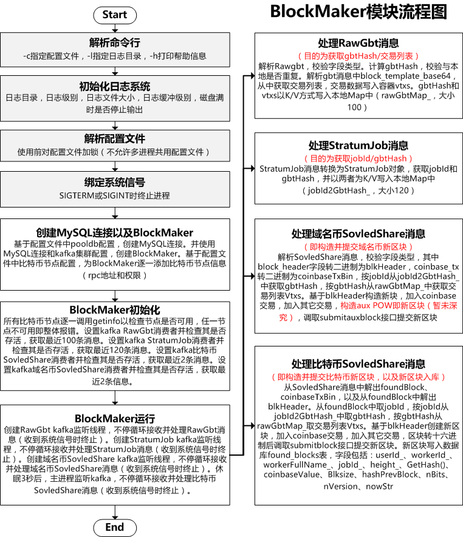

# btcpool矿池-BlockMaker模块解析

## 核心机制总结

* blkmaker可以连多个bitcoind节点
* blkmaker监听和接收4类消息：RAWGBT、STRATUM_JOB、SOLVED_SHARE和NMC_SOLVED_SHARE
* 监听RAWGBT目的为获取gbtHash/交易列表，用于构建Block，gbtHash和vtxs写入rawGbtMap_
	* rawGbtMap_保存最近100条gbtHash/vtxs对
* 监听STRATUM_JOB目的为获取jobId_/gbtHash，jobId_和gbtHash写入jobId2GbtHash_
	* jobId2GbtHash_保存最近120条jobId_/gbtHash对
* 监听SOLVED_SHARE目的为获取BlockHeader和coinbaseTx
	* BlockHeader+coinbaseTx+vtxs构造Block
* 构造好的Block会提交连接的所有bitcoind节点
* 构造好的Block入库，入库字段包括：
	* puid、worker_id、worker_full_name、job_id、height、hash
	* rewards（即coinbaseValue）、size（即blksize）、prev_hash、bits、version、created_at
	* created_at为入库时间非爆块时间

## BlockMaker命令使用

BlockMaker用于监听kafka获取新的比特币区块和域名币区块，同时监听kafka获取Gbt消息和Job消息以构造交易列表，最后拼装完整区块提交给比特币节点。

```shell
blkmaker -c blkmaker.cfg -l log_dir
#-c指定blkmaker配置文件
#-l指定日志目录
```

## blkmaker.cfg配置文件

```shell
//比特币节点
bitcoinds = (
{
  rpc_addr    = "";  //rpc地址
  rpc_userpwd = "";  //rpc权限，格式如username:password
}
);

//kafka集群
kafka = {
  brokers = "1.1.1.1:9092,2.2.2.2:9092,3.3.3.3:9092";
};

//mysql配置，用于存储已发现的块
pooldb = {
  host = "";
  port = 3306;
  username = "dbusername";
  password = "dbpassword";
  dbname = "";
};
```

## found_blocks数据库结构

[bpool_local_db.txt](bpool_local_db.txt)

```
CREATE TABLE `found_blocks` (
  `id` int(11) NOT NULL AUTO_INCREMENT,
  `puid` int(11) NOT NULL,
  `worker_id` bigint(20) NOT NULL,
  `worker_full_name` varchar(50) NOT NULL,
  `job_id` bigint(20) unsigned NOT NULL,
  `height` int(11) NOT NULL,
  `is_orphaned` tinyint(4) NOT NULL DEFAULT '0',
  `hash` char(64) NOT NULL,
  `rewards` bigint(20) NOT NULL,
  `size` int(11) NOT NULL,
  `prev_hash` char(64) NOT NULL,
  `bits` int(10) unsigned NOT NULL,
  `version` int(11) NOT NULL,
  `created_at` datetime DEFAULT NULL,
  PRIMARY KEY (`id`),
  UNIQUE KEY `hash` (`hash`),
  KEY `height` (`height`)
) ENGINE=InnoDB DEFAULT CHARSET=utf8;
```

## BlockMaker模块流程图



### 参考文档

暂无
