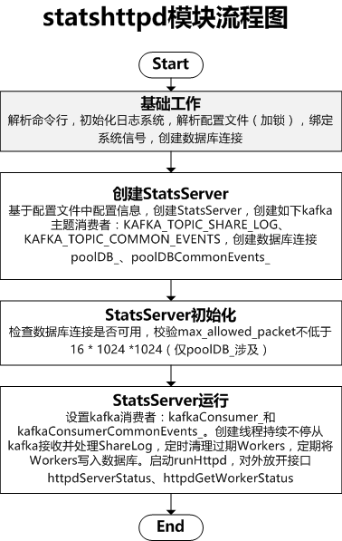

# btcpool矿池-statshttpd模块解析

## 核心机制总结

* 监听并接收SHARE_LOG，按Worker、user、pool统计acceptCount_、acceptShareSec_、rejectShareMin_
	* 同时统计totalWorkerCount_和totalUserCount_
	* 延时超过1小时的SHARE_LOG将被忽略
* 每15s写入数据库（可由flush_db_interval指定），每30分钟清理过期Worker
	* 如果Worker超过1小时未提交share，将被置为过期状态
	* 计算每个Worker的accept1m_、accept5m_、accept15m_、reject15m_、accept1h_、reject1h_
		* 以及acceptCount_、lastShareIP_、lastShareTime_
	* DROP并CREATE数据表mining_workers_tmp，Worker统计数据批量写入mining_workers_tmp
	* mining_workers_tmp数据写入数据表mining_workers
* 监听并接收COMMON_EVENTS，获取workerName和minerAgent，更新数据表mining_workers
* 启动Httpd服务，开放ServerStatus和WorkerStatus

## statshttpd命令使用

```shell
statshttpd -c statshttpd.cfg -l log_dir
#-c指定statshttpd配置文件
#-l指定日志目录
```

## statshttpd.cfg配置文件

```shell
#指定kafka集群
kafka = {
  brokers = "1.1.1.1:9092,2.2.2.2:9092,3.3.3.3:9092";
};

statshttpd = {
  #指定IP和端口
  ip = "0.0.0.0";
  port = 8080;

  #间隔15s将workers data入库
  flush_db_interval = 15;
  #最近一次写库时间
  file_last_flush_time = "/work/xxx/statshttpd_lastflushtime.txt";
};


#指定数据库配置
pooldb = {
  host = "";
  port = 3306;
  username = "dbusername";
  password = "dbpassword";
  dbname = "";
};
```

## mining_workers/mining_workers_tmp数据表结构

```c++
CREATE TABLE `mining_workers_tmp` (
  `worker_id` bigint(20) NOT NULL,
  `puid` int(11) NOT NULL,
  `group_id` int(11) NOT NULL,
  `worker_name` varchar(20) DEFAULT NULL,
  `accept_1m` bigint(20) NOT NULL DEFAULT '0',
  `accept_5m` bigint(20) NOT NULL DEFAULT '0',
  `accept_15m` bigint(20) NOT NULL DEFAULT '0',
  `reject_15m` bigint(20) NOT NULL DEFAULT '0',
  `accept_1h` bigint(20) NOT NULL DEFAULT '0',
  `reject_1h` bigint(20) NOT NULL DEFAULT '0',
  `accept_count` int(11) NOT NULL DEFAULT '0',
  `last_share_ip` char(16) NOT NULL DEFAULT '0.0.0.0',
  `last_share_time` timestamp NOT NULL DEFAULT '1970-01-01 00:00:01',
  `miner_agent` varchar(30) DEFAULT NULL,
  `created_at` timestamp NULL DEFAULT NULL,
  `updated_at` timestamp NULL DEFAULT NULL,
  UNIQUE KEY `puid_worker_id` (`puid`,`worker_id`),
  KEY `puid_group_id` (`puid`,`group_id`)
) ENGINE=InnoDB DEFAULT CHARSET=utf8;

CREATE TABLE `mining_workers` (
  `worker_id` bigint(20) NOT NULL,
  `puid` int(11) NOT NULL,
  `group_id` int(11) NOT NULL,
  `worker_name` varchar(20) DEFAULT NULL,
  `accept_1m` bigint(20) NOT NULL DEFAULT '0',
  `accept_5m` bigint(20) NOT NULL DEFAULT '0',
  `accept_15m` bigint(20) NOT NULL DEFAULT '0',
  `reject_15m` bigint(20) NOT NULL DEFAULT '0',
  `accept_1h` bigint(20) NOT NULL DEFAULT '0',
  `reject_1h` bigint(20) NOT NULL DEFAULT '0',
  `accept_count` int(11) NOT NULL DEFAULT '0',
  `last_share_ip` char(16) NOT NULL DEFAULT '0.0.0.0',
  `last_share_time` timestamp NOT NULL DEFAULT '1970-01-01 00:00:01',
  `miner_agent` varchar(30) DEFAULT NULL,
  `created_at` timestamp NULL DEFAULT NULL,
  `updated_at` timestamp NULL DEFAULT NULL,
  UNIQUE KEY `puid_worker_id` (`puid`,`worker_id`),
  KEY `puid_group_id` (`puid`,`group_id`)
) ENGINE=InnoDB DEFAULT CHARSET=utf8;
```

mining_workers_tmp数据写入数据表mining_workers

```c++
const string mergeSQL = "INSERT INTO `mining_workers` "
	" SELECT * FROM `mining_workers_tmp` "
	" ON DUPLICATE KEY "
	" UPDATE "
	"  `mining_workers`.`accept_1m`      =`mining_workers_tmp`.`accept_1m`, "
	"  `mining_workers`.`accept_5m`      =`mining_workers_tmp`.`accept_5m`, "
	"  `mining_workers`.`accept_15m`     =`mining_workers_tmp`.`accept_15m`, "
	"  `mining_workers`.`reject_15m`     =`mining_workers_tmp`.`reject_15m`, "
	"  `mining_workers`.`accept_1h`      =`mining_workers_tmp`.`accept_1h`, "
	"  `mining_workers`.`reject_1h`      =`mining_workers_tmp`.`reject_1h`, "
	"  `mining_workers`.`accept_count`   =`mining_workers_tmp`.`accept_count`,"
	"  `mining_workers`.`last_share_ip`  =`mining_workers_tmp`.`last_share_ip`,"
	"  `mining_workers`.`last_share_time`=`mining_workers_tmp`.`last_share_time`,"
	"  `mining_workers`.`updated_at`     =`mining_workers_tmp`.`updated_at` ";
```

## statshttpd流程图

